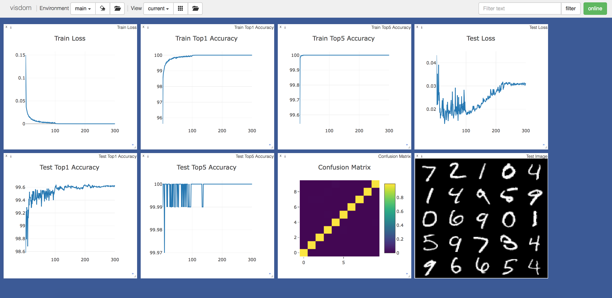

# CCCapsNet
A PyTorch implementation of Compositional coding Capsule Network based on AAAI 2018 paper [Compositional coding capsule with random sample consensus]().

## Requirements
* [Anaconda](https://www.anaconda.com/download/)
* PyTorch
```
conda install pytorch torchvision -c pytorch
```
* PyTorchNet
```
pip install git+https://github.com/pytorch/tnt.git@master
```
* PyTorch-NLP
```
pip install pytorch-nlp
```
* PorterStemmer
```
pip install PorterStemmer
```
* tqdm
```
conda install tqdm
```

## Datasets
The original `AGNews`, `AmazonReview`, `DBPedia`, `YahooAnswers`, `SogouNews` and `YelpReview` datasets are coming from [here](http://goo.gl/JyCnZq).

The original `Newsgroups`, `Reuters`, `Cade` and `WebKB` datasets can be found [here](http://ana.cachopo.org/datasets-for-single-label-text-categorization).

The original `IMDB` dataset is downloaded by `PyTorch-NLP` automatically.

We have uploaded all the original datasets into [BaiduYun](https://pan.baidu.com/s/1FrgwMzUFF8IMFY4d5_YJNA) and 
[GoogleDrive](https://drive.google.com/open?id=10n_eZ2ZyRjhRWFjxky7_PhcGHecDjKJ2). 
The preprocessed datasets have been uploaded to [BaiduYun](https://pan.baidu.com/s/1pCfF7xKQQmZ5XlrOFaSGrg) and 
[GoogleDrive](https://drive.google.com/open?id=1KDE5NJKfgOwc6RNEf9_F0ZhLQZ3Udjx5).

You needn't download the datasets by yourself, the code will download them automatically.
If you encounter network issues, you can download all the datasets from the aforementioned cloud storage webs, 
and extract them into `data` directory.

## Usage

### Generate Preprocessed Data
```
python utils.py --data_type yelp --fine_grained
optional arguments:
--data_type              dataset type [default value is 'imdb'](choices:['imdb', 'newsgroups', 'reuters', 'webkb', 
                         'cade', 'dbpedia', 'agnews', 'yahoo', 'sogou', 'yelp', 'amazon'])
--fine_grained           use fine grained class or not, it only works for reuters, yelp and amazon [default value is False]
```
This step is not required, and it takes a long time to execute. So I have generated them before, and uploaded the 
preprocessed data to the aforementioned cloud storage webs. You could skip this step, and just do the next step, the 
code will download the data automatically.

### Train Text Classification
```
python -m visdom.server -logging_level WARNING & python main.py --data_type newsgroups --num_epochs 300
optional arguments:
--data_type              dataset type [default value is 'imdb'](choices:['imdb', 'newsgroups', 'reuters', 'webkb', 
                         'cade', 'dbpedia', 'agnews', 'yahoo', 'sogou', 'yelp', 'amazon'])
--fine_grained           use fine grained class or not, it only works for reuters, yelp and amazon [default value is False]
--text_length            the number of words about the text to load [default value is 2700]
--num_iterations         initial routing iterations number [default value is 1]
--batch_size             train batch size [default value is 30]
--num_epochs             train epochs number [default value is 100]
```
Visdom now can be accessed by going to `127.0.0.1:8097/env/$data_type` in your browser, 
`$data_type` means the dataset type which you are training.

## Results
The train loss、accuracy, test loss、accuracy, and confusion matrix are showed with visdom,
the best test accuracy is ~ 99.64%.

